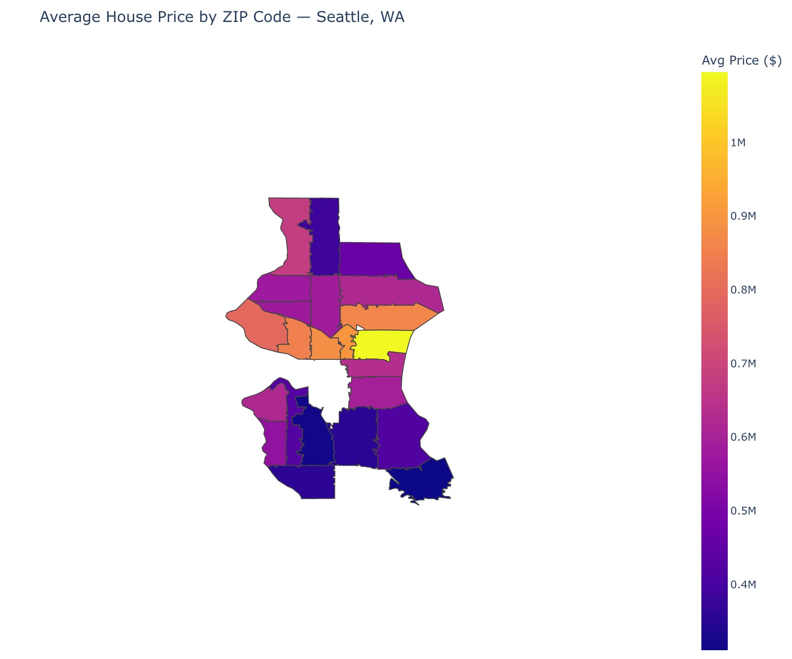
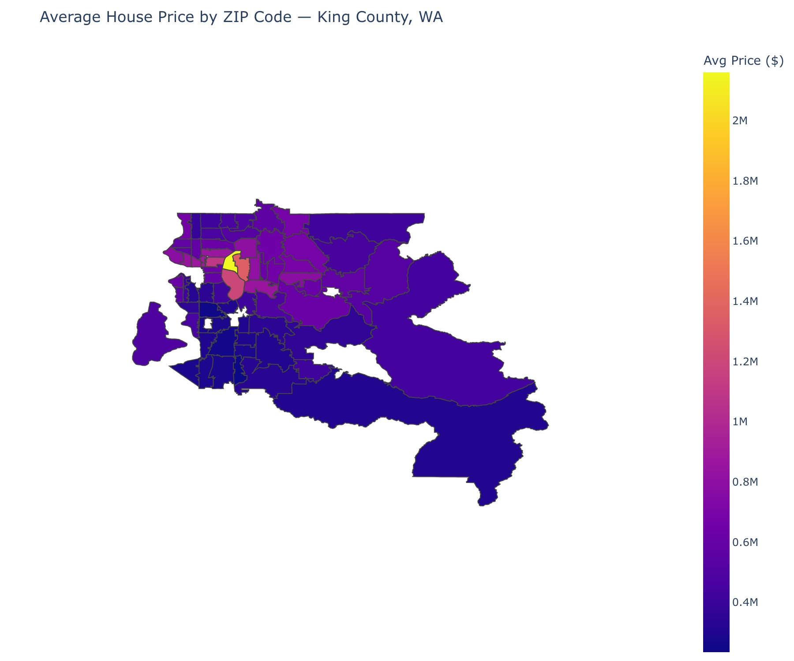

# Sound Realty House Price Prediction API

A machine learning REST API for predicting residential property prices in the Seattle, WA area.

## Project Overview

This project deploys a machine learning model as a scalable REST API service for **Sound Realty**, a property valuation company. The solution predicts house prices based on property features and demographic data, streamlining their property estimation workflow.

### Key Features

- **REST API** for real-time price predictions
- **FastAPI** framework for high-performance endpoints
- **Docker** containerization for consistent deployment
- **Automatic demographic data augmentation** from U.S. Census data
- **Health check** and model metadata endpoints
- **Comprehensive testing** with pytest and Flake8 linting

## Architecture

### Local Development Architecture


The local architecture consists of:
1. **Model Development** - Python model training pipeline saved as pickle artifact
2. **Model Artifacts** - Serialized model and feature metadata
3. **REST API** - FastAPI application with prediction endpoints
4. **Docker** - Containerized deployment for consistency across environments

### AWS Cloud Architecture


The cloud deployment leverages AWS services for scalability:
- **ECS/Fargate** - Containerized API service
- **ALB** - Load balancing for high availability
- **RDS** - Demographic data store
- **Auto Scaling** - Dynamic resource management

## API Endpoints

### `GET /health`
Health check endpoint to verify service availability.

```bash
curl http://localhost:8000/health
```

### `GET /model/info`
Retrieve model metadata including version, features, and performance metrics.

```bash
curl http://localhost:8000/model/info
```

### `POST /predict`
Make a price prediction for a property. Requires 13 property features.

```bash
curl -X POST http://localhost:8000/predict \
  -H "Content-Type: application/json" \
  -d '{
    "bedrooms": 3,
    "bathrooms": 2.0,
    "sqft_living": 2000,
    "sqft_lot": 5000,
    "floors": 1.0,
    "waterfront": 0,
    "view": 0,
    "condition": 3,
    "grade": 8,
    "sqft_above": 1800,
    "sqft_basement": 200,
    "yr_built": 2000,
    "yr_renovated": 0
  }'
```

Response:
```json
{
  "predicted_price": 425000.50,
  "currency": "USD",
  "model_version": "1.0.0"
}
```

Interactive API documentation available at `http://localhost:8000/docs`

## Getting Started

### Prerequisites
- Python 3.8+
- Docker (optional, for containerized deployment)

### Installation

1. Clone the repository:
```bash
git clone <repository-url>
cd mle-project-challenge-2
```

2. Install dependencies:
```bash
pip install -r requirements.txt
```

3. Ensure model artifacts exist:
```bash
cd model_dev
python create_model.py
cd ..
```

### Running Locally

Start the API server:
```bash
uvicorn app.main:app --reload
```

The API will be available at `http://localhost:8000`

### Running with Docker

Build and run the containerized application:
```bash
docker build -t sound-realty-api .
docker run -p 8000:8000 sound-realty-api
```

## Testing

Run the test suite:
```bash
pytest tests/
```

Run linting checks:
```bash
flake8 app/ model_dev/ tests/
```

## Data Insights

### Seattle Average House Price by ZIP Code



This visualization shows property price distribution across Seattle ZIP codes, with warmer colors indicating higher average prices.

### King County Average House Price by ZIP Code



Extended price analysis across King County, revealing regional variations in property valuations.

## Project Structure

```
mle-project-challenge-2/
├── app/                          # FastAPI application
│   ├── main.py                   # API entry point
│   ├── api/                      # API route handlers
│   ├── schemas/                  # Request/response models
│   ├── services/                 # Business logic
│   └── core/                     # Configuration & logging
├── model_dev/                    # Model training pipeline
│   ├── create_model.py           # Model creation script
│   └── model/                    # Trained model artifacts
├── data/                         # Training and reference data
│   ├── kc_house_data.csv
│   ├── zipcode_demographics.csv
│   └── future_unseen_examples.csv
├── tests/                        # Test suite
├── Dockerfile                    # Container configuration
├── requirements.txt              # Python dependencies
└── README.md                     # This file
```

## Model Performance

The model is evaluated on:
- **Root Mean Squared Error (RMSE)** - Primary evaluation metric
- **Feature importance** - 13 numeric property features
- **Generalization** - Validation on unseen data from King County

## Deployment Considerations

### Scalability
- **Stateless API design** enables horizontal scaling
- Load balancing distributes requests across multiple instances
- Auto-scaling policies respond to demand fluctuations

### Model Updates
- Deploy new model versions without service interruption
- Blue-green deployment strategy for seamless transitions
- Versioning system tracks model changes

### Monitoring
- Health check endpoints for continuous monitoring
- Logging integration for diagnostic analysis
- Model metrics tracked for performance degradation

## Future Improvements

- Feature engineering for improved predictions
- Model retraining pipeline with scheduled updates
- Advanced demographic data integration
- A/B testing framework for model versions
- Enhanced monitoring and alerting
